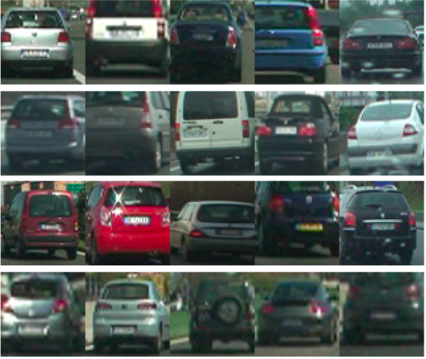
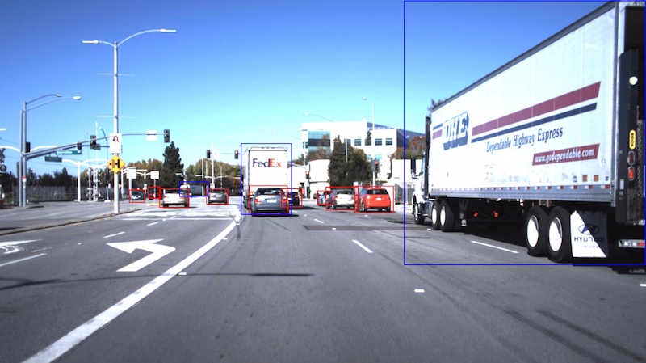
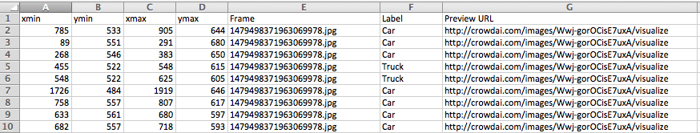
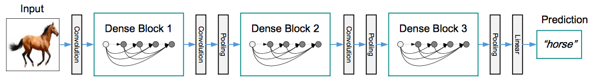
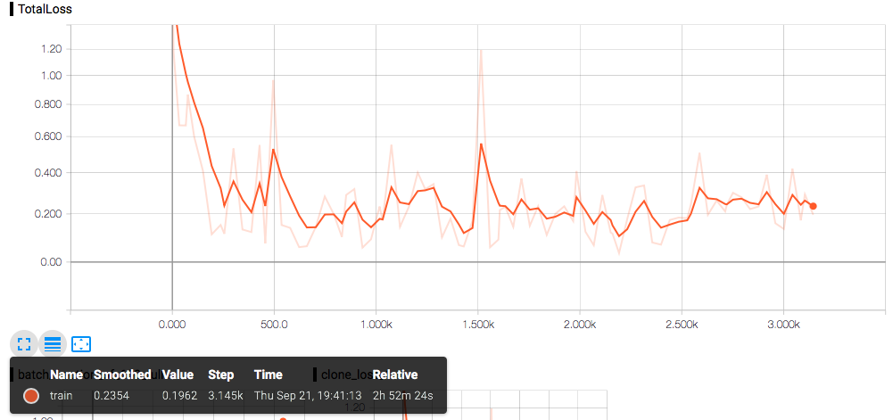

# Machine Learning Engineer Nanodegree
## Capstone Project: Vehicle Detection using Faster R-CNN and DenseNet
Hasan Tuncer
Sep 27, 2017

## I. Definition

### Project Overview
Self-driving cars are finally becoming real. Their impact on people's live and economy will be tremendous [[1](https://medium.com/startup-grind/mind-blowing-driverless-future-fcc5197d509)]. There are so many interesting challenges come with self-driving car technology. One of them is detection of surrounding objects including other vehicles. This information is necessary to make a right decision such as turning without causing any safety problem. My goal is to create a machine learning pipeline for detecting vehicle(s) on a road from a video. The video is captured by a forward looking camera mounted on a vehicle.

There are two main data types used for detecting objects in self-driving car domain:

1) Detecting the objects from images captured by camera. [Elon Musk](https://www.youtube.com/watch?v=zIwLWfaAg-8&feature=youtu.be&t=14m48s) and [comma.ai](https://comma.ai) are members of the community believing in this approach.  

2) Detecting the objects from point clouds captured using Light Detection and Ranging (LIDAR) technology. Majority of the self-driving car startups bets on LiDar technology such as [Waymo](https://waymo.com).

In this project, I will follow the first approach due to extensive data and benchmark resources.

Detecting an object from an image is one of the main reasearch areas of computer vision. Deformable part models (DPMs) and convolutional neural networks (CNNs) are two widely used distinct approaches. DPM are graphical models (Markov random fields) and use an image scanning technique, such as sliding window approach where the classifier such as SVM is run at evenly spaced locations on the image. CNNs are nonlinear classifiers. CNNs are more popular due to their good performance on object detection [[2](https://arxiv.org/pdf/1409.5403.pdf)].

Region-based convolutional neural networks ([R-CNN](https://arxiv.org/abs/1311.2524)) trains CNNs end-to-end to classify the proposed regions into object categories or background. R-CNN deploys region proposal algorithms (such as [EdgeBoxes](https://www.microsoft.com/en-us/research/publication/edge-boxes-locating-object-proposals-from-edges/) and [Selective Search](https://www.koen.me/research/pub/vandesande-iccv2011.pdf)) to select the region in pre-processing step before running the CNN as classifier. [Faster R-CNN](https://arxiv.org/pdf/1506.01497.pdf) uses CNN both for the region proposal and also for the prediction. [Google Inception](https://arxiv.org/abs/1409.4842) uses Faster R-CNN with [ResNet](https://arxiv.org/abs/1512.03385). On the other hand, recently published [DenseNet](https://arxiv.org/pdf/1608.06993.pdf) outperforms ResNet. [YOLO](https://arxiv.org/abs/1506.02640) solves region proposal and associated class probabilities with a single neural network. [Single Shot Multibox Detector](https://arxiv.org/abs/1512.02325) also accomplishes  region proposal generation, feature resampling stage and inference with a single deep neural network.  SSD's key feature is the use of multi-scale convolutional bounding box outputs attached to multiple feature sets for prediction. YOLO and Faster R-CNN use single set of feature set for prediction. SSD processing time is shorter than YOLO and Faster R-CNN.

### Problem Statement

Vehicle detection is important for public safety and security, surveillance, intelligent traffic control and autonomous driving.  Self-driving cars need to identify objects around them such as other vehicles on the road. In this problem, the objects are captured as a video by a forward looking camera mounted on a vehicle. Identification of a vehicle will be important factor in deciding the next action that self-driving car will take such as changing lane. It is a challenging problem due to the large variations in appearance and camera viewpoint, weather, lightening and occlusions. From machine learning perspective, this problem is a classification problem rather than regression. My goal is to differentiate the objects on the road from the background, sky, hill, or road. Then classify if they are vehicle or not. The output will also be a video similar to the input.  However,  other vehicles in the video will be shown in box and tracked along the way.

### Metrics
I will use [average precision (AP)](http://homepages.inf.ed.ac.uk/ckiw/postscript/ijcv_voc09.pdf) metric. AP is the area under the precision/recall curve. Precision reflects out of all the items labeled as positive, how many truly belong to the positive class. Precision is ratio of true positive instances to the sum of true positive and false positives. Recall reflects out of all the items that are truly positive, how many were correctly classified as positive. Or simply, how many positive items were 'recalled' from the dataset. It is  the ratio of true positive instances to the sum of true positives and false negatives.  

The reason that I pick average precision: In my model I will query if the object is vehicle or not. I don't have multiple object classes.  The precision at every correct point is: how many correct vehicle images have been encountered up to this point (including current) divided by the total images seen up to this point. The reason of not using mean average precision (most used metric in object detection studies) is that I do not multiple object classes hence no multiple queries on the model.

## II. Analysis

### Data Exploration

Training data for object detection model is  [annotated images](https://github.com/udacity/self-driving-car/tree/master/annotations) provided by CrowdAI. It contains over 65,000 labels across 9,423 frames (in JPG format) collected from a Point Grey research cameras running at full resolution of 1920x1200 at 2hz. The dataset includes labels for car, truck and pedestrian. I removed the pedestrian label as my goal is not to identify pedestrians but vehicles. Labels.csv retrieved from [download link](http://bit.ly/udacity-annoations-crowdai) has wrong column order which causes an error during cropping object images. So the column order needs to be changed to x_min, y_min, x_max, y_max, Frame, Label, Preview URL.

Training data for object classification model is the labeled data for [vehicle](https://s3.amazonaws.com/udacity-sdc/Vehicle_Tracking/vehicles.zip) and [non-vehicle](https://s3.amazonaws.com/udacity-sdc/Vehicle_Tracking/non-vehicles.zip) which are retrieved by Udacity from  [GTI vehicle image database](http://www.gti.ssr.upm.es/data/Vehicle_database.html) and [the KITTI vision benchmark suite](http://www.cvlibs.net/datasets/kitti/). The data has two classes: vehicle and non-vehicle. There are around 8800 images at each class. The images are 64x64 pixels, in RGB color space with no Alpha channel and in portable network graphics (PNG) format.

Non-vehicle images are extracted from road sequences not containing vehicles. Vehicle images includes high variety of vehicle make, model and color. One important feature affecting the appearance of the vehicle is the position of the vehicle relative to the camera. Therefore,  images are separated in four different regions according to the pose: middle/close range in front of the camera, middle/close range in the left, close/middle range in the right, and far range. In addition, the images are extracted in such a way that they do not perfectly fit the contour of the vehicle in order to make the classifier more robust to offsets in the hypothesis generation stage. Instead, some images contain the vehicle loosely (some background is also included in the image), while others only contain the vehicle partially

I made sure that I have equal number of samples from both vehicle and non-vehicle classes.

I randomize the inputs before splitting them.  %80 of input data is for training while %20 is for validation.

I will run my pipeline on [the test video](https://github.com/htuncer/machine-learning/blob/master/projects/capstone/data/videos/test_video.mp4) provided by Udacity.

### Exploratory Visualization

20 vehicle images taken from [GTI](http://www.gti.ssr.upm.es/data/Vehicle_database.html). As seen in the pictures below, there is good variation of colors, make and point of views in the images.

](https://github.com/htuncer/machine-learning/blob/master/projects/capstone/data/sample_vehicle.png) taken from 

Vehicle position/distance to camera is in varying ranges and not equally distributed as seen below. It would be better if they were equally distributed.I won't remove the images to balance the distribution because my goal is to have as many input as possible to train my model. Unfortunately, I don't have distribution of the images retrieved from KITTI that is 5966 images.

Sample annotated image from CrowdAI database that is used for object detection is as follows:

As seen in the image, there may be boxes which are well exceeding the object boundaries. See the truck on the left and close to the camera. This may led object detection model to behave the same.

First 10 rows of [labels.csv](https://github.com/htuncer/machine-learning/blob/master/projects/capstone/data/annotated_images/labels.csv) for annotated images is below

As seen in the the statistics of the labels.csv, there are 66389 annotations in total. I calculated the area of the object boxes (in unit of pixel square). There is high variation of the areas of object boxes which may reflect high variation of the position of the vehicles to the camera or the vehicle size.

Out of 66389 annotations 94.24% of them  belong to cars rest is Truck. This reflect the real world scenario where we happen to see cars a lot more compared to Trucks. All these annotations are on 9420 images in total.

### Algorithms and Techniques
Faster R-CNN will be used for object region detection. DenseNet will be used for classification if the detected object is a vehicle or not. Both of these models are state-of-the art in object detection and classification. See Domain Background section for details of these models. I will use the pre-trained version of Faster R-CNN and DenseNet because it may take days to train a model from scratch. [Faster R-CNN inception resnetv2](https://github.com/tensorflow/models/blob/master/object_detection/g3doc/detection_model_zoo.md) is pre-trained on [COCO](http://mscoco.org). [DenseNet](https://github.com/liuzhuang13/DenseNet) is pre-trained on [ImageNet](http://www.image-net.org). COCO and ImageNet are large datasets containing thousands of images for hundreds of object types. Faster R-CNN and DenseNet will go through supervised training with vehicle/non-vehicle dataset that I mentioned above. The images in these data sets will be resized to match the image sizes used during pre-train process. I don't expect to make other pre-processing on the images.

The trained model will be applied to frames of a video. The output of the model will be converted back as video where vehicles bounded with box and tracked along the way.

### Benchmark

I use [KITTI benchmark suit](http://www.cvlibs.net/datasets/kitti/eval_object.php), that includes performance comparison of models in vehicle detection scenario.The result of Faster R-CNN has already been noted in [*](http://www.cvlibs.net/datasets/kitti/eval_object_detail.php?&result=3a25efaffca8895ffba2a65a5cbe4254d8dda259)

## III. Methodology

### Data Preprocessing
#### Processing Data for Object Detection Model
Tensorflow object detection API accepts inputs in the form of tf records. [create_tf_record.py](https://github.com/htuncer/machine-learning/blob/master/projects/capstone/create_tfrecord.py) converts annotated images in data/annotated_images folder into tf_records. The annotation data comes with the images is [labels.csv](https://github.com/htuncer/machine-learning/blob/master/projects/capstone/data/annotated_images/labels.csv) The order of box coordinates for objects were wrong. I change it as x_min, y_min, x_max, and y_max. I discard objects labeled as pedestrian as my goal is not to detect pedestrians. There are only objects left with two labels left: car and truck. I normalize the box coordinates for each objects. I randomize the inputs before converting them to tf_records. I use 8,000 images to train and 2000 images to validate object detection API performance. I can not use more images due to out of memory or resource exhaustion error at google cloud machine learning engine and google cloud GPU instance. The output is train.record and val.record in data directory. For detailed implementation please see [train.ipynb](https://github.com/htuncer/machine-learning/blob/master/projects/capstone/train.ipynb) See [my guideline](https://github.com/tensorflow/models/blob/3bf85a4eddb9c56a28cc266ee4aa5604fb4d8334/object_detection/g3doc/using_your_own_dataset.md)

The input images are resized as per the image resizing scheme described in the [Faster R-CNN paper](https://arxiv.org/pdf/1506.01497.pdf). We always resizes an image so that the smaller edge is 600 pixels. If the longer edge is greater than 1024 edges, it resizes such that the longer edge is 1024 pixels. The resulting image always has the same aspect ratio as the input image. See [faster_rcnn_gpu.config](https://github.com/htuncer/machine-learning/blob/master/projects/capstone/models/faster_rcnn/faster_rcnn_gpu.config) for details.

#### Processing Data for Object Classification Model
_load_data_ method in [densenet.py](https://github.com/htuncer/machine-learning/blob/master/projects/capstone/densenet.py) reads all the images into numpy array. CV2 library reads the images in BGR format. Images are resized to 224x224.
Mean pixel of the images are subtracted to make the dataset compatible with the pre-trained models:
x[:, :, :, 0] -= 103.939
x[:, :, :, 1] -= 116.779
x[:, :, :, 2] -= 123.68

All the images are shuffled. %70 of them used for training %30 used for validation.

My classifier is binary classifier, meaning identifies if object is a vehicle or not. The number of classes(or labels) is set to two. Non-vehicle images got class 0 while vehicle images got class 1 tag.

### Implementation

#### Implementing Object Detection Model
I use  [google Tensorflow object detection api](https://github.com/tensorflow/models/tree/master/research/object_detection) to detect vehicle on image. Therefore, I add it as sub-repo to my github project. Then, I add the libraries to my python path by running the following command in _tf_models_ directory:

$export PYTHONPATH=$PYTHONPATH:`pwd`:`pwd`/slim

Training an object detection model from scratch requires huge computational resource and time. Therefore, I used the already trained model in [Tensorflow Detection Model Zoo](https://github.com/tensorflow/models/blob/3bf85a4eddb9c56a28cc266ee4aa5604fb4d8334/object_detection/g3doc/detection_model_zoo.md) I picked faster_rcnn_inception_resnet_v2_atrous_coco which is pre-trained Faster R-CNN inception resnetv2 model. The reason of selecting Faster R-CNN is its high accuracy [result](https://arxiv.org/abs/1611.10012).

Tensorflow accepts class labels in pbtxt file. Hence, I create [data/label_map.pbtxt](https://github.com/htuncer/machine-learning/blob/master/projects/capstone/data/label_map.pbtxt) as per the instructions [here](https://github.com/tensorflow/models/blob/3bf85a4eddb9c56a28cc266ee4aa5604fb4d8334/object_detection/g3doc/using_your_own_dataset.md)

I need to configure the model before fine-tuning with my own data set. Therefore, I create  [faster_rcnn_gpu.config](https://github.com/htuncer/machine-learning/blob/master/projects/capstone/models/faster_rcnn/faster_rcnn_gpu.config). Make sure you set num_classes as per the classes your model will detect. In my case, it is 2: car and truck. Then you need to set paths for:

- fine_tune_checkpoint: the directory where you have the pre-trained model.
- input_path: the path for your training record, train.record.
- label_map_path: the path for label_map.pbtxt

I use batch size of 1 due to memory constraints. The learning rate that I applied is .0003.  
You can keep the rest of the config file as you retrieved from the [sample configuration](https://github.com/tensorflow/models/blob/3bf85a4eddb9c56a28cc266ee4aa5604fb4d8334/object_detection/samples/configs/faster_rcnn_inception_resnet_v2_atrous_pets.config).

Now, it's time to fine-tune the model with your own data by running the following command from the main directory i.e., ../capstone/

python tf_models/object_detection/train.py --logtostderr --pipeline_config_path=models/faster_rcnn/faster_rcnn_gpu.config --train_dir=models/faster_rcnn/train/

You need to manually stop the training, otherwise it will run 200K steps which was initially used by google to train the model on COCO data set. I had to stop it at ~3K steps due to expensive cloud computing resources and time constraints.

Meanwhile, run the following command to evaluate the trained model:

python tf_models/object_detection/eval.py --logtostderr --pipeline_config_path=models/faster_rcnn/faster_rcnn_gpu.config --checkpoint_dir=models/faster_rcnn/train/ --eval_dir=models/faster_rcnn/eval/

Few minutes later, run the following command to see the evaluation results on the Tensorboard.

tensorboard —logdir models/faster_rcnn/

If you are satisfied with the performance of the model, then We need to export a graph to use ay inference phase. I exported graph by running:

python tf_models/object_detection/export_inference_graph.py --input_type image_tensor --pipeline_config_path models/faster_rcnn/faster_rcnn_gpu.config  --trained_checkpoint_prefix models/faster_rcnn/train/model.ckpt-3084 --output_directory models/faster_rcnn/output

Remember to give the highest number for model.ckpt in the directory. After succesful execution of the command, you should see the following files in models/faster_rcnn/outpu:
tuncer@ins1:~/machine-learning/projects/capstone$ ls -lh models/faster_rcnn/output/
total 465M
-rw-rw-r-- 1 tuncer tuncer 77 Sep 22 02:45 checkpoint
-rw-rw-r-- 1 tuncer tuncer 231M Sep 22 02:45 frozen_inference_graph.pb
-rw-rw-r-- 1 tuncer tuncer 227M Sep 22 02:45 model.ckpt.data-00000-of-00001
-rw-rw-r-- 1 tuncer tuncer 42K Sep 22 02:45 model.ckpt.index
-rw-rw-r-- 1 tuncer tuncer 7.2M Sep 22 02:45 model.ckpt.meta
drwxr-xr-x 3 tuncer tuncer 4.0K Sep 22 02:46 saved_model

Now, it is time to do inference on the video frames. I upload the previously trained model using tf.Graph(). See [inference.ipynb]((https://github.com/htuncer/machine-learning/blob/master/projects/capstone/inference.ipynb)). When you run the prediction on the model, the output will be boxes that includes coordinates of an object in the form of [y_min, x_min, y_max, x_max]. Keep in mind that the values of coordinates are normalized. For each box, you will see corresponding class value and confidence score for the prediction in classes and scores variables.

The model detects 100 object at max, you can change the value in faster_rcnn_gpu.config file if you want it to be something different. There may be tens of output boxes that by and large show the borders of the same object. I find out Tensorflow non max suppression method to decrease the number of the boxes. However, depending on the number of output we would like to get from  non max suppression and the value of iou_threshold, the number of false positives and false negatives changes

For evaluation of my model, I use Tensorflow object detection api and Tensorboard. See [guideline](https://github.com/tensorflow/models/blob/3bf85a4eddb9c56a28cc266ee4aa5604fb4d8334/object_detection/g3doc/running_locally.md)
All the steps and commands that I used are documented in [train.ipynb](https://github.com/htuncer/machine-learning/blob/master/projects/capstone/train.ipynb) and [inference.ipynb](https://github.com/htuncer/machine-learning/blob/master/projects/capstone/inference.ipynb)

#### Implementing Object Classification Model
I implement DenseNet to classify object as per the [DenseNet paper](https://arxiv.org/pdf/1608.06993.pdf). My implementation of DenseNet is in [densenet.py](https://github.com/htuncer/machine-learning/blob/master/projects/capstone/densenet.py)

Following figure shows how DenseNet works in high level.

Fig. 2: A deep DenseNet with three dense blocks. The layers between two adjacent blocks are referred to as transition layers and change feature-map sizes via convolution and pooling. [Source.](https://arxiv.org/pdf/1608.06993.pdf)

densenet_model(img_rows, img_cols, color_type=1, nb_dense_block=4, growth_rate=48, nb_filter=96, reduction=0.5, dropout_rate=0.0, weight_decay=1e-4, num_classes=1000, weights_path=None):

My DenseNet model uses the following parameters and the corresponding values:
- img_rows:224 (input image width in pixels)
- img_cols: 224 (input image column in pixels)
- color_type: 3 (input image channels. In our case, 3 representing Blue, Green, and Red)
- nb_dense_block: 4 (number of dense blocks to add to end)
- growth_rate: 48 (number of filters to add per dense block)
- nb_filter: 96 (initial number of filters)
- nb_layers = [6, 12, 36, 24] the number of layers of convovlution block to append to the model. Note that, block id designates which value from the array to be used.
- reduction: 0.5 (reduction factor of transition blocks)
- dropout_rate:0.0 (dropout rate)
- weight_decay:1e-4 (weight decay factor)
- learning_rate:1e-3 (learning rate)
- eps = 1.1e-5 (epsilon for batch normalization)
- classes: 2(number of classes to classify images: vehicle and non-vehicle )
- weights_path: (path to pre-trained weights) I use [pre-trained
 DenseNet](https://github.com/liuzhuang13/DenseNet) on ImageNet for object classification.

Inside of DenseNet model, I have the following functional modules. Each module uses the above parameter values - if not stated otherwise.

In my convolution block, I applied BatchNormalization, Relu activation, 1x1 Conv2D, 3x3 Conv2D, and optional dropout. I use no dropout value during my training.

In the transition block, I applied BatchNorm, 1x1 Convolution, averagePooling, optional compression, dropout. I used 1.0 for compression that is to reduce the number of feature maps in the transition block.

I build a dense block where the output of each convolution block is fed into subsequent one. The function accepts, input tensor, stage (index for dense block), nb_layers, nb_filter, growth_rate, dropout_rate, weight_decay(1e-4), grow_nb_filters(True, flag to decide to allow number of filters to grow).

 For the transfer learning, I could not use  model.layers.pop() since model is not of Sequential() type. I truncate and replace softmax layer for transfer learning.

I use helper method used for scaling the input.  The method  accepts a set of weights and biases and use them to scale the input data. The method gets the following parameters:
- axis: integer, axis along which to normalize in mode 0. For instance,
    if your input tensor has shape (samples, channels, rows, cols),
    set axis to 1 to normalize per feature map (channels axis).
- momentum: momentum in the computation of the
    exponential average of the mean and standard deviation
    of the data, for feature-wise normalization.
- weights: Initialization weights.
    List of two Numpy arrays, with shapes:
    `[(input_shape,), (input_shape,)]`
- beta_init: name of initialization function for shift parameter. This parameter is only relevant if you don't pass a `weights` argument.
- gamma_init: name of initialization function for scale parameter. This parameter is only relevant if you don't pass a `weights` argument.

The implementation is in [densenet_custom_layers](https://github.com/htuncer/machine-learning/blob/master/projects/capstone/densenet_custom_layers.py). In [densenet.py](https://github.com/htuncer/machine-learning/blob/master/projects/capstone/densenet.py) you will see this method used as Scale.

The model by default uses data/densenet161_weights_tf.h5 if not provided with weights.

I used my own image dataset to finetue the model, other than CIFAR. load_data method in densenet.py reads all the images into numpy array. Note that CV2 reads the images in BGR format. Images are resized to 224x224. Mean pixel of the images are subtracted to make the dataset compatible with the pre-trained models:
 img[:, :, :, 0] -= 103.939
 img[:, :, :, 1] -= 116.779
 img[:, :, :, 2] -= 123.68

 All the images are shuffled. %70 of them used for training %30 used for validation.
 My classifier is binary classifier, meaning identifies if object is a vehicle or not. The number of classes is set to two. Non-vechicle images got class 0 while vehicle images got class 1 tag. This is different then what we have done in tensorflow that it requires classes to start from 1, not 0.

See [train.ipynb](https://github.com/htuncer/machine-learning/blob/master/projects/capstone/train.ipynb) and [inference.ipynb](https://github.com/htuncer/machine-learning/blob/master/projects/capstone/inference.ipynb) for details of my implementation.

For validation of my classification model, I use [average precision](http://scikit-learn.org/stable/modules/generated/sklearn.metrics.average_precision_score.html) from  sklearn library. It's pretty straight forward, the method accepts valid Y values and predicted values for validation set. The output is a floating number between 0 and 1. Average Precision is closer 1, the better the performance.

Make sure that you are not running object detection and classification models at the same time. Both of the models are using Tensoflow. They try to allocate all the memory in the GPU from the very beginning. Not to face with memory problems, I increased the swap file to 50 GB. The machine I used in Google Cloud is n1-standard-4 (4 vCPUs, 15 GB memory) with 1 GPU  that is NVIDIA Tesla K80). It took few hours to train the models.

### Refinement
To train object detection API, I  was initially thinking to use labeled data ([vehicle](https://s3.amazonaws.com/udacity-sdc/Vehicle_Tracking/vehicles.zip) and [non-vehicle](https://s3.amazonaws.com/udacity-sdc/Vehicle_Tracking/non-vehicles.zip) which are retrieved by Udacity from  [GTI vehicle image database](http://www.gti.ssr.upm.es/data/Vehicle_database.html) and [the KITTI vision benchmark suite](http://www.cvlibs.net/datasets/kitti/) ). I was giving the full size of the image as object coordinates. However, it returned poor performance. Later, I used  [annotated data set](https://github.com/udacity/self-driving-car/tree/master/annotations) provided by CrowdAI. The annotated data set has multiple objects in every objects. It improved the performance of the detection model 20%.

I started first with high number of input images for my model. I either got memory or resource exhaustion error. Even if everything would go well, the training time would take days. Therefore, I started with small number of images like 1000. However, I needed to push the input size to 10,000 to increase the performance. After properly creating the tf_records, I was able to make %30 performance improvement from the initial results. On the output video, the model was able to detect at least 3 cars all the time.

For tensorflow object detection API, I tried different learning rates. However, the best performance came with googles original proposal that is the order of 0.0003. See [faster_rcnn_gpu.config](https://github.com/htuncer/machine-learning/blob/master/projects/capstone/models/faster_rcnn/faster_rcnn_gpu.config) Pleasee see results section for the results.

Tensorflow object detection API returns both object box coordinates on the image and also the class of the image. However, on top of Tensorflow classification, applying DenseNet classification improves the accuracy around 10%. One significant impact of DenseNet was to eliminate the false positives generated by Faster R-CNN. See output video.

For object classification, I stick to DenseNet model explanation in DenseNet paper as it is already state of the art. However, I lowered batch size to fit into my compute instance memory. I increased the number of epochs to get better model performance. But the performance difference was not significant at all.

## IV. Results

### Model Evaluation and Validation
I ran  my object detection model, Faster R-CNN, about 3K steps with a batch size of 1. The total loss value per steps of running Faster R-CNN is shown in the diagram below. The total loss value  decreases pretty fast from 1.2 to 0.2. The reason of this decline is using pre-trained model. Having low total loss is indication of good performance

On the other hand, I ran my object classification model with 10 epochs and batch size of 1. the average precision score of my object classification model is 0.67839921517. Average precision result ccan get max. of 1. 0.67 is not great performance result and it is lower than the results posted on [the KITTI vision benchmark suite](http://www.cvlibs.net/datasets/kitti/)

Given the computing resources challenges (Google cloud is charging every minite :)) and time constraints, I could not improve performance of my models with more inputs.

## V. Conclusion

### Free-Form Visualization
I applied the final model on [the video](https://github.com/htuncer/machine-learning/blob/master/projects/capstone/data/videos/test_video.mp4). The output video can be retrieved from [here](https://github.com/htuncer/machine-learning/blob/master/projects/capstone/data/videos/out_video.mov).

As you will see in the video, there are some false positives and false negatives. Tensorflow object detection API returns many object boxes even for the same object. I applied non max suppression. Among many factors, depending on the number of output we would like to get from  non max suppression and value for iou_threshold, the number of false positives and false negatives changes.

### Reflection

Vehicle detection is important for public safety and security, surveillance, intelligent traffic control and autonomous driving.  Self-driving cars need to identify objects around them such as other vehicles on the road. In this problem, the objects are captured as a video by a forward looking camera mounted on a vehicle. I used Tensorflow object detection API for detecting the objects in video frames. Then, DenseNet for classifying the detected objects. Both of the model were pre-trained on large datasets: [COCO](http://mscoco.org) and [ImageNet](http://www.image-net.org). Then, I trained  the models with vehicle and non-vehicle images. Then applied final models is applied on the  test video.

Working on two models: Faster R-CNN and DenseNet required so much effort because, I was executing the whole machine learning cycle (data creation, model creation, tuning, validation/evaluation, saving etc.) two times for each model. This was extremely time consuming. However at the end I learned so many new things and I appreciate the knowledge. This capstone project may be considered just a proof of concept.  It helped me to realize how hard it can be to make a production ready system.

The first challenge for me the computing resource related problems: less memory, less CPU etc. I was trying to run the models on my macbook. Then, I tried to use Google  Machine Learning Engine. However, I got OOM, out of memory and resource exhaustion errors. I could not find solutions to those problems. Then, I used google cloud platform and GPU instance for the  first time. After having few problems related to GPU and SWAP files, I was able to successfully run the models. I realized how computing intensive is dealing with lots of images. Further it also takes great time to compute and slows down progress on the project.

The second challenge for me was reading the input images and converting them into numpy arrays or the format that each model require. I learned few good things about image coloring formats: BGR, RGB, greyscale and alpha channels etc.

The third challenge for me was to limit the number of objects detected by the Tensorflow object detection API. By default it detects at most 100 objects on an image. There may be tens of output boxes that by and large show the borders of the same object. I find out Tensorflow non max suppression method to decrease the number of the boxes. However, depending on the number of output we would like to get from  non max suppression and the value of iou_threshold, the number of false positives and false negatives changes.

### Improvement
The model can definitely be improved by using at least 2-3 times more image input. I could not use much input resources because of computing resource and time limitations. Further, I could also run training longer. Note that Tensorflow object detection API is fine tuned on pet data in COCO by running the model 200K steps.

The same model can be applied not only vehicles but also traffic lights, pedestrians or other object types as long as you fine-tune with related images. One interesting training would be on car models and years using [Stanford AI Cars Dataset](http://ai.stanford.edu/~jkrause/cars/car_dataset.html)
